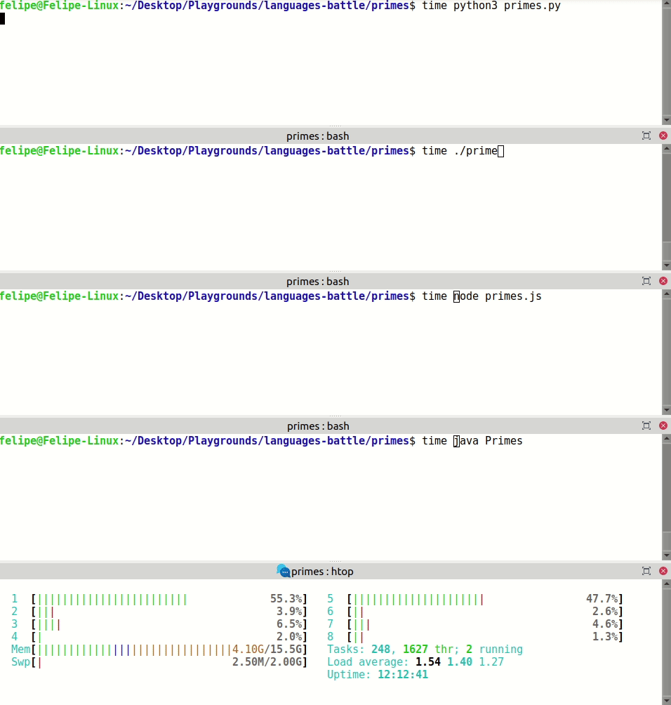
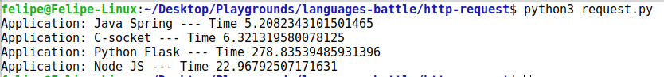

# languages-battle
Programming Languages Perfomance Comparisons

## Primes Calculator

```bash
cd primes
./run.sh
```

### Competitors

* C/C++
* Java
* Python3
* NodeJS



## Primes Calculator on Http Web Server with Parallel Requests

```bash
cd http-request
./run.sh
```

### Competitors

* C Sockets
* Java Spring
* Python3 Flask
* NodeJS Express


